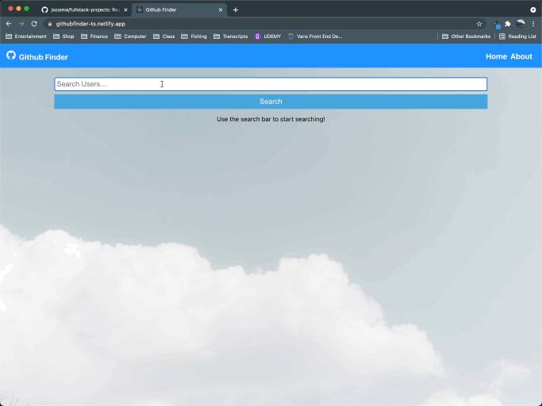
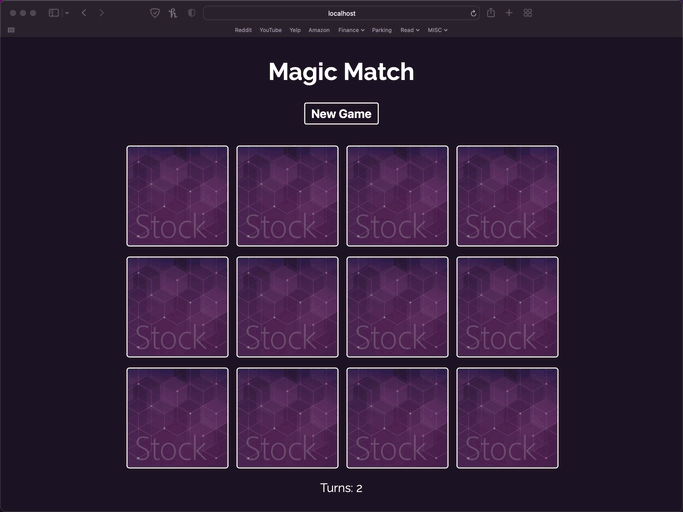
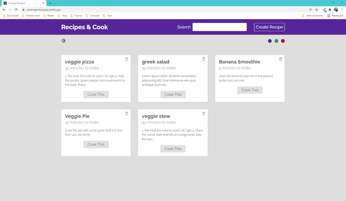

# Full-Stack Projects

## Introductions
A small collection of full stack projects from scratch to fully deployed.

## Links
👇 Click on image links below! 👇

---

## Projects
<!-- GITHUB FINDER -->
[github-finder]: https://github.com/jsoomie/fullstack-projects/tree/main/github-finder
[github-finder-deployed]: https://githubfinder-ts.netlify.app/

<!-- CONTACT KEEPER -->
[contact-keeper]: https://github.com/jsoomie/fullstack-projects/tree/main/contact-keeper
[contact-keeper-deployed]: #

<!-- MAGIC MATCH -->
[magic-match]: https://github.com/jsoomie/fullstack-projects/tree/main/magic-match
[magic-match-deployed]: https://serene-raman-79c0e2.netlify.app

<!-- Recipes & Cook -->
[recipes-cook]: https://github.com/jsoomie/fullstack-projects/tree/main/cooking-recipes
[recipes-cook-deployed]: https://cookingandrecipes.netlify.app

1. [Github Finder Repo][github-finder] || [Deployed Link][github-finder-deployed]
   1. Create a github user finder application. Create fetch of github users with the use of a search bar. 
   2. Create a clear bar after searching users. First, start using class components then refactor into functional components. Not fully full stack as there is no server, however this is just a stepping stone for what's to come.

---

2. [Contact Keeper Repo][contact-keeper] || [WIP][contact-keeper-deployed]
   1. Create full stack project as contact keeper. 
   2. To be able to create contact info on certain user and save that info to MongoDB.

---

3. [Magic Match Repo][magic-match] || [Deployed Link][magic-match-deployed]
   1. Quickly create a card matching game with simple animtions

---

4. [Cooking Recipes Repo][recipes-cook] || [Deployed Link][recipes-cook-deployed]
   1. Create a recipe list creator.
   2. Able to view, search, update and remove recipes
   3. Utilize REACT's context and reducers hooks
   4. Introduction to firebase firestore database!

## Screenshots
### Github Finder

### Magic Match

### Cooking Recipes

## Changelogs 
[Github Finder Logs](https://github.com/jsoomie/fullstack-projects/blob/main/github-finder/README.md)

[Contact Keeper Logs](https://github.com/jsoomie/fullstack-projects/blob/main/contact-keeper/README.md)

[Magic Match Logs](https://github.com/jsoomie/fullstack-projects/blob/main/magic-match/README.md)

[Cooking Recipes Logs](https://github.com/jsoomie/fullstack-projects/blob/main/cooking-recipes/README.md)

---
---

## License
